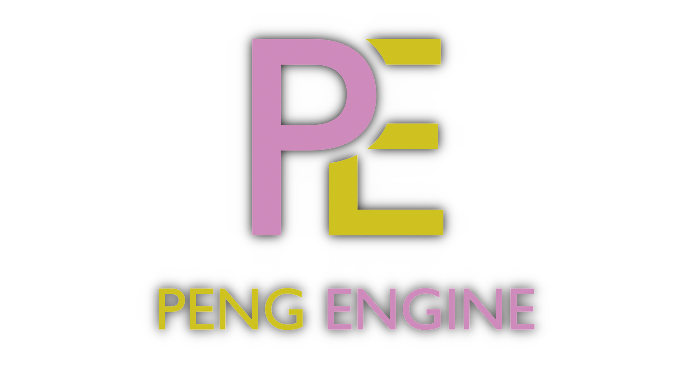

  

  
  

**Peng Engine** is a custom game engine built with C++23 and OpenGL 4.3+ with minimal use of [third party](docs/third-party.md) libraries.

Requires Visual Studio 2022 to compile

Follow the [devlog](https://qfsw.itch.io/peng-engine/devlog) on itch.io

_more details coming soon_